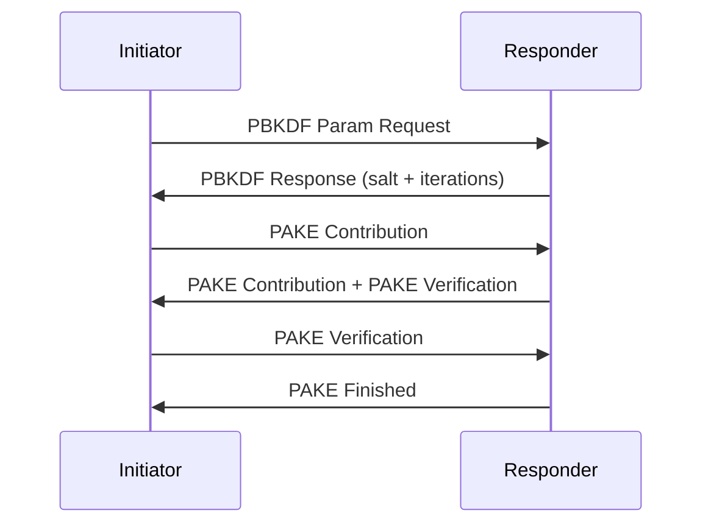

# SPAKE2+

A crystal lang implementation of SPAKE2+

* see: https://datatracker.ietf.org/doc/pdf/draft-bar-cfrg-spake2plus-02.pdf

This is the specific draft used by Matter protocol

## Installation

1. Add the dependency to your `shard.yml`:

   ```yaml
   dependencies:
     spake2_plus:
       github: spider-gazelle/spake2_plus
   ```

2. Run `shards install`

## Usage

This is a basic overview of how matter protocol performs PAKE



In code this looks like

```crystal
require "spake2_plus"

# the configuration matter uses
algorithm = SPAKE2Plus::Algorithms.new(:p256, :sha256, :hmac)

# As part of registration we swap salt and iteration params
# PBKDF Param Request
random = Random.new
iterations = random.rand(1000..100_000)
salt = random.random_bytes(random.rand(16..32))

# both initiator and responder encode the password / pin
# for Matter this is a UInt32 passcode encoded in little endian
passcode = 1122334455_u32
io = IO::Memory.new
io.write_bytes(passcode, IO::ByteFormat::LittleEndian)
context = io.to_slice

# > The Initiator provides PAKE Contribution
# ==========================================
w0, w1 = algorithm.compute_w0_w1(context, salt, iterations)
initiator = SPAKE2Plus.new(context, w0, algorithm)
x = initiator.compute_x # send x as pake1 to responder

# < Responder provides PAKE Contribution and verification
# =======================================================
w0, l = algorithm.compute_w0_l(context, salt, iterations)
responder = SPAKE2Plus.new(context, w0, algorithm)
y = responder.compute_y
ke, h_ay, resp_verify = responder.compute_secret_and_verifiers_from_x(l, x, y)
# send y, resp_verify as pake2 to initiator

# > The Initiator verifies and sends verifier
# ===========================================
ke, init_verify, h_bx = initiator.compute_secret_and_verifiers_from_y(w1, x, y)
raise "init verification failed" unless h_bx == resp_verify
# send init_verify as pake3 to responder

# < Responder validates and sends PakeFinished
# ============================================
raise "resp verification failed" unless h_ay == init_verify
puts "success!"
```

## Contributors

* [Stephen von Takach](https://github.com/stakach) - creator and maintainer
